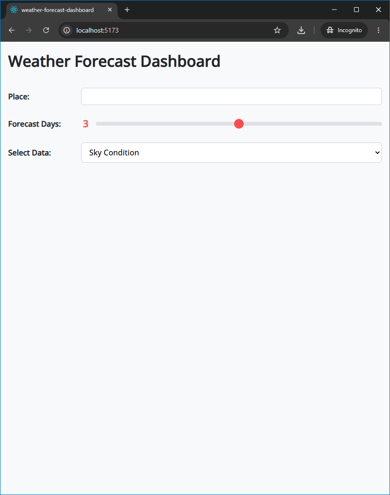
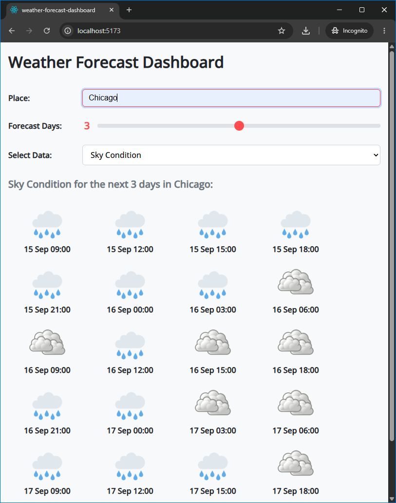
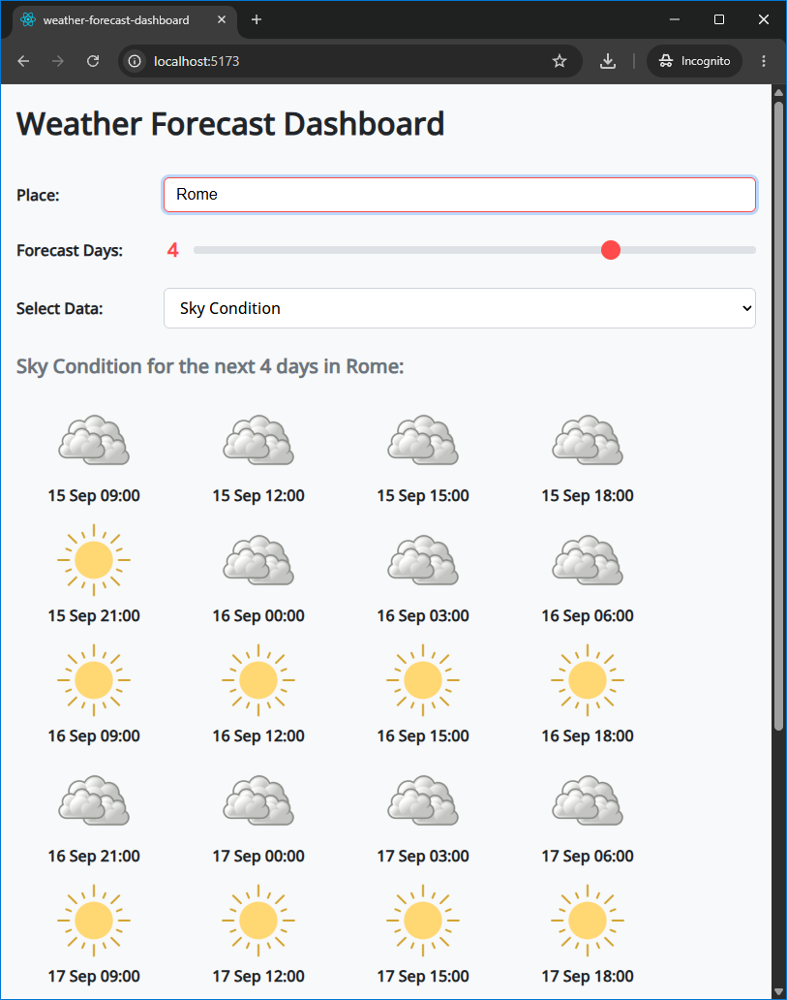
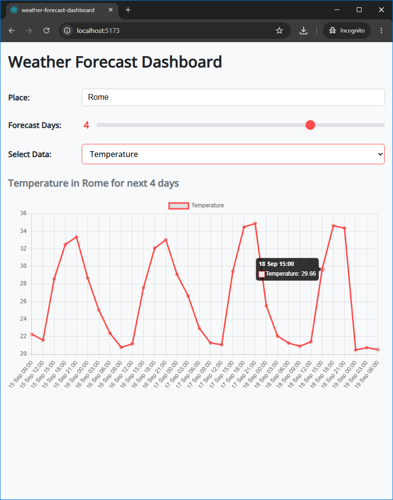
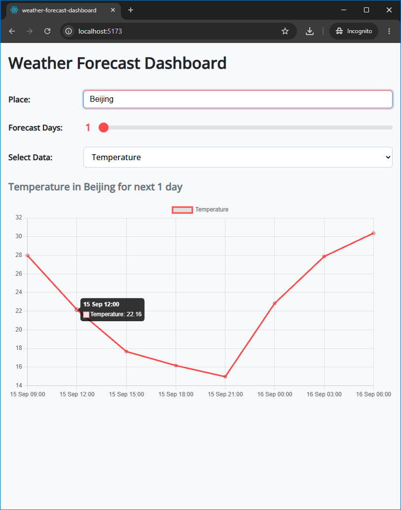

# Weather Forecast Dashboard

An interactive React dashboard that fetches 5-day / 3-hour forecast datasets from OpenWeatherMap, providing dual-mode visualization for local sky conditions and real-time temperature trend charts.

## Project Overview

<p align="center">
   
   
</p>
<p align="center">
   
   
</p>
<p align="center">
   
</p>

---

## Features

* Dual Visualization Modes:
  * Sky Condition View: Displays visual weather icons (Clear, Clouds, Rain, Snow) for every 3-hour interval over the selected period.
  * Temperature Trend View: Renders responsive line charts tracking temperature variations across 3-hour timestamps via Chart.js.
* Flexible Forecast Ranges: Configurable duration slider allowing users to query between 1 and 5 days of forecast data (up to 40 data points).
* Timezone Localization: Automatic UTC-to-local datetime conversions powered by dayjs to display accurate regional timestamps.
* Dynamic Chart Cleanup: Strict canvas context lifecycle management (useRef and Chart.js instance destruction) to prevent memory leaks during re-renders.

---

## Tech Stack

* Frontend: React, Chart.js, Day.js
* API Provider: OpenWeatherMap (5 Day / 3 Hour Forecast API)
* Styling: Custom CSS

---

## Getting Started

### Prerequisites
* Node.js (v20.19+) & npm
* Git
* A free API Key from [OpenWeatherMap](https://openweathermap.org/api)

### Installation & Setup

1. **Clone the repository**:
    ```bash
    git clone https://github.com/Alireza3044/weather-forecast-dashboard.git
    cd weather-forecast-dashboard
    ```
   
2. **Install dependencies**:
    ```bash
    npm install
    ```
   
3. **Configure environment variables**:
   Create a `.env` file in the root directory:
    ```env
    VITE_API_KEY=your_openweathermap_api_key_here
    ```

4. **Start the development server**:
    ```bash
    npm run dev
    ```
